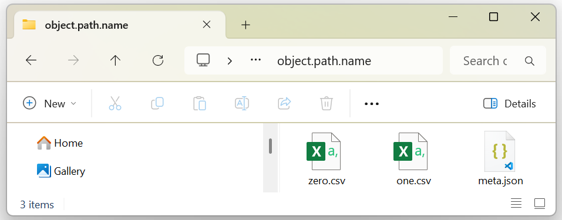

base
================================================
The first package in RomCom's alphabetical :doc:`plan` is the :doc:`api/rc/base/index` package,
pervasively underpinning the entire :doc:`RomCom Library<api/rc/index>`.

The package consists of two modules which we shall describe in reverse order.
Contrary to their (alphabetically expressed) functional dependence,
:doc:`api/rc/base/models/index` makes sense of :doc:`api/rc/base/definitions/index`
because the latter is principally motivated and exemplified by the former.

.. _baseModels:

models
---------------------
RomCom software objects derive from BaseClasses contained in the :doc:`api/rc/base/models/index` module.
They consist of *DataBases* made of Tables and Meta.
These components are **always** perfectly synchronized with the filesystem.

*Store*
^^^^^^^^^^^^
An abstract BaseClass whose objects are endowed with filesystem storage in ``self.path``.

Every Class derived from *Store* has a (constant) classAttribute ``Store.ext`` specifying its file extension.
This is implicitly appended to any path sent or received by the *Store*.

*Store* regards itself as the *SuperClass* of all files and folders.

.. _baseMeta:

Meta
^^^^^^^^^
A concrete *Store*, consisting of :ref:`MetaData<baseTypes>` stored in a ``.json`` file.

.. _baseTable:

Table
^^^^^^^^^^^^
A concrete *Store*, consisting of a :ref:`DataFrame<baseTypes>` stored in a ``.csv`` file.

Tables are created from ``DataFrame | Table``, and may be updated from :ref:`TableData<baseTypes>`.
These operations are governed by :term:`CRUD` :ref:`baseProtocols` described below.

The :ref:`TableData<baseTypes>` held in a ``table`` object is accessed in the desired :ref:`ecosystem <ecosystem>`
format as the property ``table.df``, ``table.np``, or ``table.tc``.

Every Table begins with a single ``table.head`` (alias ``table.df.columns``) of column names.
Multiple levels in ``table.head`` are separated by :term:`con`.

Multiple heads in a ``src.csv`` must be :term:`conjoined<conjoin>` before a Table can be created, often as::

    table = Table.create(path, Table.conjoinHeads(src, path, headcount))

where ``headcount`` counts the :term:`heads<head>` in ``src.csv``.

The body below ``table.head`` may contain data of just two Types: :ref:`Category<baseTypes>` and :ref:`Float<baseTypes>`.
Every column must be of homogeneous Type: either all ``Category`` (including :term:`null`) or all ``Float`` (including :term:`null`).

The ``table.schema`` is a ``dict[str, Type]`` mapping column names (``table.head``) to their Types (``Category | Float``).

The classAttributes ``Table.readOptions`` and ``Table.writeOptions`` govern ``.csv`` file options.
These constants should only be tailored by SubClassing.

RomCom is replete with SubClasses of Table fulfilling specific needs.
For example, ``Design`` is a concrete subclass of Table designed to hold training data.

.. _baseDataBase:

*DataBase*
^^^^^^^^^^^^
An abstract *Store*, housing a Schema
(a `NamedTuple <https://typing.python.org/en/latest/spec/namedtuples.html>`_ of Tables) with Meta.

The Tables in any *DataBase* ``object`` are the property ``object.tables: Schema[Table, ...]`` and
its Meta the property ``object.meta: MetaData``.

Any concrete SubClass such as ``MyDataBase`` must define ``MyDataBase.Schema(NamedTuple)``
which indexes ``MyDataBase.defaults()`` by ``MyDataBase.names()``.

For example, ``MyDataBase`` may define ``MyDataBase.Schema(NamedTuple)`` as::

    class MyDataBase(DataBase)
        Schema(NamedTuple)
            zero: Table | TableData | type[Table] = DataFrame([0])
            one: Table | TableData | type[Table] = DataFrame([1])

        schema: Schema[type[Table], ...] = Schema(zero=Table, one=Table)

The last line is required to tell MyDataBase which SubClasses of Table to expect.
This is how ``schema`` communicates ``Table.readOptions``, ``Table.writeOptions`` and other functionality.
Reflecting its programmatic content, an ``object`` of type ``MyDataBase`` would appear on the filesystem as

The  :term:`CRUD` :ref:`baseProtocols` are implemented so that a *DataBase* may safely reside
alongside other files (or folders) in ``self.path`` and its parents without affecting them.

Most models in RomCom are some Type of concrete *Database*.

definitions
----------------------
RomCom's Types and *Protocols* are contained in the :doc:`api/rc/base/definitions/index` module.

.. _baseTypes:

Types
^^^^^^^^^^^^^^^^^
RomCom Types abide by the robustness principle

    Be conservative in what you send, be liberal in what you accept.
        [`Postel's Law <https://en.wikipedia.org/wiki/Robustness_principle>`__]

.. glossary::

    *ReturnType* and *ArgumentType*
        RomCom methods send *ReturnTypes* and accept *ArgumentTypes*.

    Path and PathLike
        Files and folders are of *ReturnType* Path (alias ``Pathlib.Path``) and *ArgumentType* PathLike (alias ``Path | str``).

    IndexP.Index and IndexLike
        Elements are Indexed by *ReturnType* :doc:`IndexP.Index <api/rc/base/definitions/IndexP.Index>` (alias ``tuple[int]``) and
        *ArgumentType* IndexLike (alias ``str | int | Iterable[str | int] | slice``).

    DataFrame
        Alias `pl.DataFrame <https://docs.pola.rs/api/python/stable/reference/dataframe/index.html>`__
        holds the data in any :ref:`baseTable`.
        A DataFrame is a 2D tabular data structure composed of one or more named, Type-homogeneous columns

    Category
        Any datum of Type ``int | str | bool`` in a DataFrame is cast to ``Category``
        (alias `pl.Categorical <https://docs.pola.rs/user-guide/expressions/categorical-data-and-enums/#data-type-categorical>`__).
        A Category is a variable with a finite set of discrete values, much like an enum.

    Float
        Any :term:`decimal fraction` or :term:`NaN` in a DataFrame is cast to ``Float`` (alias ``pl.Float32``).

    Np and Tc Tensors
        *Np* and *Tc* are *AbstractClasses* extending Types to NumPy (``np``) and PyTorch (``tc``),
        such as ``Np.Tensor=np.ndarray`` , ``Tc.Tensor`` , ``Np.Matrix`` , ``Tc.Matrix`` , ``Np.Vector`` , ``Tc.Vector``.
        These are to express intention when heavy math is being done.

    MetaData
        :ref:`baseMeta` is sent and accepted as MetaData (alias ``Mapping[str, Any]``), often passed as :term:`kwargs`.

    TableData
        :ref:`Tables <baseTable>` are sent and accepted as TableData (alias ``DataFrame | Np.Matrix | Tc.Matrix``).

.. _baseProtocols:
*Protocols*
^^^^^^^^^^^^^^^^^
The `Lifecycle of Software Objects <https://en.wikipedia.org/wiki/The_Lifecycle_of_Software_Objects>`__ in RomCom
follows the conventional :term:`CRUD` biography, told on the user's filesystem.
Software objects in RomCom are also named, and their content indexed by element and compared with other objects.
The :doc:`api/rc/base/index` :ref:`baseModels` are responsible for implementing these *Protocols* in RomCom, as follows.

*NameP*
+++++++++++++++++
The *NameP Protocol* provides ``str(store) = str(store.path.name)`` and ``format(store) = repr(store) = str(store.path)``
for any ``store`` derived from *Store*.

*IndexP*
+++++++++++++++++
Items are retrieved or replaced using the *IndexP Protocol*, as in::

    values = store[index]  # Retrieves item(s) from store
    store[index] = values  # Replaces item(s) in store
    len(store)             # Counts the items accessible by index
    for index in store:
        if index in store: print('is always True')

where ``index`` must be of *ArgumentType* :ref:`IndexLike <baseIndex>`.
When ``index`` is Iterable, ``values`` must be an ``Np.Matrix | Tc.Matrix`` or ``tuple[Np.Matrix | Tc.Matrix,...]``.

*IndexP* is conceptually identical to a Python `sequence <https://docs.python.org/3/glossary.html#term-sequence>`__.

.. glossary::

    Meta
        *IndexP* refers to ``dict`` items, but writes updates to disk immediately.

    Table
        *IndexP* refers to ``table.head`` by column name, so ``len(table)`` is its width (complementing ``len(table.pl)`` its height).

    *DataBase*
        *IndexP* refers to ``database.tables`` by name.

*EqualsP*
+++++++++++++++++
The *EqualsP Protocol* enables::

    storeA == storeB

which exhaustively compares all content except for ``path``.
If two stores of the same Type share the same location, they are surely identical for the filesystem is always synchronized with memory.
So the only interesting comparison is between stores whose ``path`` differs.

This is straightforward, but we may as well highlight some pedantry

.. glossary::

    *DataBase*
        Two *DataBase* stores are equal if and only if their ``.meta`` is equal, their ``.tables`` are equal,
        and their ``.names()`` are equal. This is **not** the same as::

            dataBaseA.meta == dataBaseB.meta and dataBaseA.tables == dataBaseB.tables

        because `NamedTuple <https://typing.python.org/en/latest/spec/namedtuples.html>`_ equality does not compare names.

        Two equal *DataBase* stores need not be of the same Type, nor share ``dataBaseA.Schema is dataBaseB.Schema``.
        They are equal if and only if their **contents** are equal, regardless of their own Types.

*CreateP*
+++++++++++++++++
Every derived ``Class(Store)`` possesses a ``Class.create(path)`` classMethod
returning a store of Type ``Class`` created in ``path``.

Every derived ``Class(Store)`` implements *CreateP* selectively, preserving other files in ``path`` intact and unaffected.
``DataBase.create(path, tableData_and_metaData)`` will not harm any files (or folders) in ``path`` and its parents.

Alternatively,
``Store.create(path)`` deletes everything in its ``path`` before (re-)creating it.

*ReadP*
+++++++++++++++++
Every ``store`` of derived ``Class(Store)`` is read from ``path`` by its constructor ``store = Class(path)``
defined in ``Class.__init__(path)``.

*UpdateP*
+++++++++++++++++
Every ``store`` of derived ``Class(Store)`` is updated in place and written in ``store.path`` by the
function ``store(update=None)`` defined in ``__call__(self, update=None)``.

SubClasses frequently override ``__call__(self,update=None)`` to perform some validation or calibration before updating.

*DeleteP*
+++++++++++++++++
Every class derived from *Store* has a ``delete(path)`` classMethod which deletes a *Store*.

Every derived ``Class(Store)`` implements *DeleteP* selectively, preserving other files in ``path`` intact and unaffected.
So ``DataBase.delete(path)`` preserves all other files (or folders) in ``path`` and its parents, unlike ``Store.delete``.

Alternatively,
``Store.delete(path)`` deletes everything in its ``path`` before (re-)creating it. Which can be useful.

*CopyP*
+++++++++++++++++
Every derived ``Class(Store)`` possesses a ``Class.copy(src: Class, dst: PathLike)`` classMethod
returning a copy of ``src`` created in ``dst``.

``Class.copy(src, dst)`` is entirely selective. The operation neither affects nor is affected by
any extraneous files (or folders) in ``src.path`` and ``dst`` and their parents.

