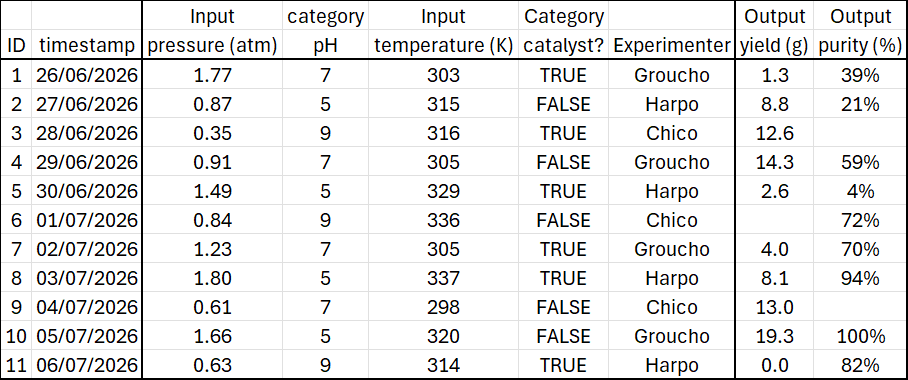
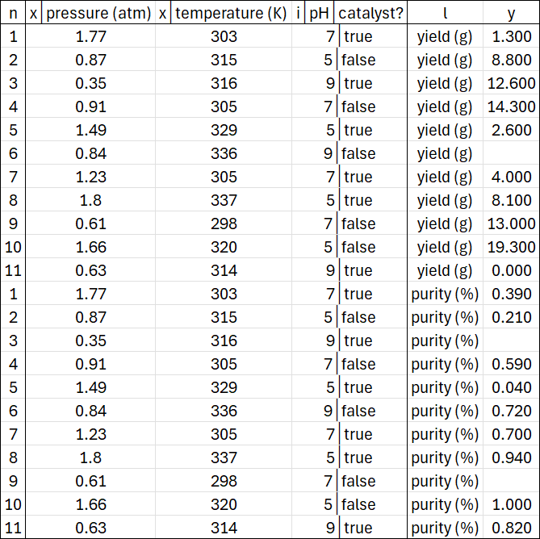
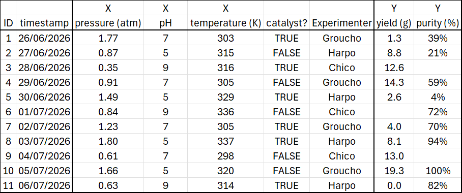
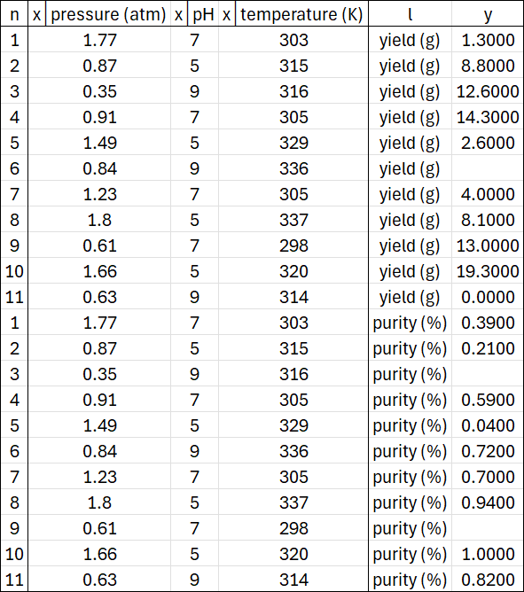
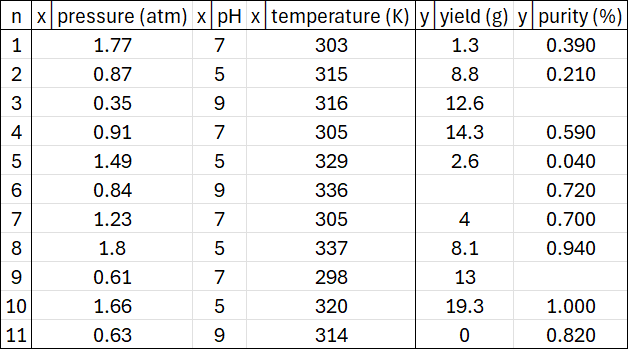

data
==================================
Following :doc:`base`, the second package in RomCom's alphabetical :doc:`plan` is :doc:`api/rc/data/index`.
This is the gateway through which you pass your :ref:`dataExperiments` to RomCom.

The :doc:`api/rc/data/index` package is mainly concerned with receiving information.
There is little analytic output here, but you must negotiate the gateway to access the RomCom's alphabetically subsequent analytic packages.

The heart of the :doc:`api/rc/data/index` package is a subClass of :term:`Table` called :term:`Design`.
Design is RomCom's gatekeeper, validating each :term:`experiment`.

Quickstart experiments
------------------------
Before delving further we show examples of valid :ref:`dataExperiments`, and the Designs they produce.

RomCom accepts experiments with Float inputs (:ref:`x-axes<datax>`), Category inputs (:ref:`i-axes<datai>`), and Float Outputs (:ref:`y-axes<datay>`).
Every experiment must have at least one :ref:`datax` and at least one :ref:`datay`, where :term:`axis` is simply synonymous with column.
Category inputs may or may not be present as :ref:`i-axes<datai>`, Category outputs are not supported.

Here is an ``'experiment.csv'`` with two :ref:`x-axes<datax>` ``'pressure (atm)', 'temperature (K)'``, two :ref:`i-axes<datai>` ``'pH', 'catalyst?'``, and two :ref:`y-axes<datay>` ``'yield (g)', 'purity (%)'``

This experiment is not a Table, because it has two :term:`heads<head>`.
The top head of any experiment is crucial to RomCom, as it contains the :term:`axisType` telling RomCom how to interpret each column.
If the experiment were a Table, RomCom would assume its head conjoined, taking the :term:`axisType` as prefix to the leftmost :term:`con` in each axis head.

Running this code::

    design = Design.create('path', Table.conjoinHeads('experiment', 'path')
    # Table.ext = '.csv' is implicit in Table file operations.

creates this Design in ``path``

The code converts ``experiment`` to a Table in ``path`` from which a Design is created in the same location.
The Table automatically casts ``pH`` and ``temperature (K)`` to ``Category`` data (because they are integers).
This is overridden by the :term:`axisType` ``'x'`` (synonymous with ``'Input'``) which casts ``'temperature (K)'`` to Float.
On the other hand ``'pH'`` is of :term:`axisType` ``'i'`` (synonymous with ``'category'``).

Provided the :ref:`datan` is leftmost, experiments may provide :term:`axes<axis>` in any order.
Within each :term:`axisType`, the order of :term:`axes<axis>` is preserved.
However, the axisTypes in any Design appear from left to right in order :ref:`n<datan>`, :ref:`x<datax>`, :ref:`i<datai>`, :ref:`l<datal>`, :ref:`y<datay>`.

Every Design :term:`unpivots<unpivot>` multiple y-axes into a single y-axis, the original y-axis names cast to Category in the l-axis.

Native Designs conjoin all i-axes into one.

As we shall shortly see there are also fat Designs, which unjoin all i-axes into ``J`` consecutive i-axes.

Both Table and Design retain :term:`null` values. RomCom robustly ignores them in calculations.

Running the same code on a slightly amended ``experiment.csv``

creates a Design three x-axes, no i-axes, and two y-axes.

.. _dataExperiments:
Experiments
----------------------
RomCom is, broadly speaking, a data analysis library. To avoid overworking the word \"data\", we refer to the
subject of analysis as an :term:`experiment`.
Put bluntly, this is just a ``.csv`` file containing outputs alongside the inputs which produced them.

The :doc:`api/rc/data/index` package translates valid experiments into standardized :ref:`dataDesigns`.

Schemas
^^^^^^^^^^^^^^^^^^^^^
The first thing RomCom must infer from a valid experiment is a schema of what each column represents (input, output, etc.).
In RomCom terminology this means the experiment must communicate its axisTypes.

.. _dataAxes:
Axes and axisTypes
^^^^^^^^^^^^^^^^^^^^^
As the math advances in later packages, evocative vocabulary will help.
For this reason we call each column in an experiment an :term:`axis`.

Every recognized axis has an :term:`axisType` according to::

    Design.axisLexicon: = {'index': 'n',
                'input': 'x', 'in': 'x', 'continuous': 'x', 'float': 'x',
                'category': 'i', 'cat': 'i', 'discrete': 'i', 'int': 'i', 'str': 'i',
                'output-axis': 'l', 'y-axis': 'l', 'output axis': 'l', 'y axis': 'l',
                'output': 'y', 'out':'y', 'map': 'y', 'func':'y', }

The axisLexicon is case-insensitive and any unrecognized axis is discarded -- Designs contain only recognized axes.

RomCom recognizes then places each :term:`axisType` as follows.

.. _datan:
n-axis
++++++++
The row index. A single axis, recognized as the leftmost column in any experiment. Will be placed leftmost in a Design.

.. _datax:
x-axis
++++++++
Continuous input. One or more axes recognized by axisLexicon. Will be placed to the right of the :ref:`datan` in a Design.

.. _datai:
i-axis
++++++++
Categorical input. Zero or more axes recognized by axisLexicon. Will be placed to the right of the :ref:`x-axes<datax>` in a Design.

.. _datal:
l-axis
++++++++
Output axis -- see :ref:`dataPivoting`. Zero or one axes recognized by axisLexicon. Will be placed to the left of the :ref:`datay` in a Design.

.. _datay:
y-axis
++++++++
Continuous output. One or more axes recognized by axisLexicon. Will be upivoted to a single y-axis placed rightmost in a Design.

.. _dataPivoting:
Output Pivoting
^^^^^^^^^^^^^^^^^^^^^
The :ref:`datal` axisType enables two output formats called pivoted and unpivoted.
RomCom can readily switch between these formats, **but will not mix them**.

Pivoting applies only to continuous outputs :ref:`datay`. RomCom will not pivot any inputs.

Every experiment is either pivoted or unpivoted, never both.
Every Design is unpivoted, but can easily :doc:`api/rc/data/designs/Design.yPivot` to a Table (an experiment but not a Design).

Pivoted
++++++++++
The most common data format for users, a pivoted experiment usually has several :ref:`y-axes<datay>`,
each a different output dimension (naturally, that is why we call them axes).

This format is relatively short and fat, and is selected by having no :ref:`datal` axis.

The instance method :doc:`api/rc/data/designs/Design.yPivot` creates a pivoted Table such as

Unpivoted
++++++++++
RomCom's native format, an unpivoted experiment has exactly one :ref:`datal` axis and exactly one :ref:`datay` axis.

The :ref:`datay` varies by row, according to the :ref:`datal` Category.

This format is relatively tall and thin, and is selected by having one :ref:`datal` axis.
When this happens, RomCom assumes an unpivoted experiment and discards all but the leftmost :ref:`datay` axis

benchmarks
-----------
The :doc:`api/rc/data/benchmarks/index` module consists entirely of test functions, which are wrapped versions of
`SALib test functions <https://salib.readthedocs.io/en/latest/api/SALib.test_functions.html>`_.
This module provides no core functionality to RomCom, only pre-packaged benchmarking facilities.
In other words, it is an experiment factory, designed to test and exercise RomCom.

Each benchmark :doc:`api/rc/data/benchmarks/ishigami`, :doc:`api/rc/data/benchmarks/sobolG`, :doc:`api/rc/data/benchmarks/oakley2004` outputs a vector of 3 outputs.
For a given vector function, each output component is computed with a different set of parameters.

There is a benchmark :doc:`api/rc/data/benchmarks/combo` which is the 9 dimensional concatenation of
:doc:`api/rc/data/benchmarks/ishigami`, :doc:`api/rc/data/benchmarks/sobolG`, :doc:`api/rc/data/benchmarks/oakley2004`.

The benchmark :doc:`api/rc/data/benchmarks/combo` is also available as :doc:`api/rc/data/benchmarks/categorized`.
This is a scalar function which recognizes two :ref:`i-axes<datai>`, namely ``f in ('ish', 'sob', 'oak')``
and ``p in (0, 1, 2)``, which which determine which of the 9 components of :doc:`api/rc/data/benchmarks/combo` is computed.

.. _dataDesigns:
designs
-----------
The :doc:`api/rc/data/designs/index` module is absolutely central to using RomCom.
It is the conduit through which you will pass the data to be analysed.
This must be structured and formatted correctly, as described in this section.

