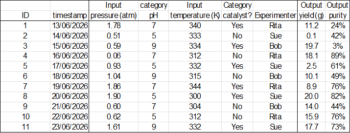

data
==================================
RomCom is an alphabetically ordered hierarchy outlined in :doc:`plan`.
The hierarchy begins with the :doc:`base` package, providing RomoCom's software foundation.
The second package in the hierarchy is :doc:`api/rc/data/index`, which this page describes.

The :doc:`api/rc/data/index` package is the conduit through which you will communicate your experiments to RomCom.
The :doc:`api/rc/data/index` package is mainly concerned with receiving information, not sending it.
There is very little analytic output here, but it is the gateway to the powerful analytics of the later hierarchy.

A quickstart example
----------------------
Here is a typical toy experiment you might provide to RomCom

Running this code

RomCom now understands the toy experiment appears as this RomCom native *Design*

Experiments
----------------------
RomCom is, broadly speaking, a data analysis library. To avoid overworking the word "data", we refer to the
subject of analysis as an :term:`experiment`.
Put bluntly, this is just a table of outputs alongside the inputs which produced them.

An experiment could be a spreadsheet, a ``.csv`` file or any kind of table, so long as any reported output sits alongside the input which produced it.

RomCom understands any experiment as a *Design*, which means a tightly formatted and validated experiment.
The :doc:`api/rc/data/index` package is responsible for translating experiments into *Designs*.

Schemas
^^^^^^^^^^^^^^^^^^^^^
The first thing RomCom must infer from an experiment is a schema of what each column represents (input or output for example).
In RomCom terminology, this means that any experiment must communicate its axisTypes.

.. _dataAxes:
Axes and axisTypes
^^^^^^^^^^^^^^^^^^^^^
As later packages become more mathematically advanced, evocative vocabulary will be helpful.
Pre-empting this, we shall refer to any column in an experiment as an :term:`axis`.
Every recognized axis has an :term:`axisType` according to::

Design.axisLexicon = {'index': 'n',
                    'input': 'x', 'in': 'x', 'continuous': 'x', 'float': 'x',
                    'category': 'i', 'cat': 'i', 'discrete': 'i', 'int': 'i', 'str': 'i',
                    'outputaxis': 'o', 'outputindex': 'o', 'outputcategory': 'o',
                    'output': 'y', 'out':'y', 'map': 'y', 'func':'y', }

This lexicon is case-insensitive, and any unrecognized axis is discarded.
RomCom identifies each :term:`axisType` as follows.

.. _datan:
n
++++++++
The row index. A single axis, identified as the leftmost column in any experiment.

.. _datax:
x
++++++++
Continuous input. One or more axes identified by case-insensitive label. Will be placed to the right of :ref:`datan`.

.. _datai:
i
++++++++
Categorical input. Zero or more axes identified by case-insensitive label. Will be placed to the right of :ref:`datax`.

.. _datao:
o
++++++++
Output axis -- see :ref:`dataPivoting`. Zero or one axes identified by case-insensitive label. Will be placed to the right of :ref:`datai`.

.. _datay:
y
++++++++
Continuous output. One or more axes identified by case-insensitive label. Will be placed to the right of :ref:`datao`.

.. _dataPivouting:
Output Pivoting
^^^^^^^^^^^^^^^^^^^^^
The :ref:`datao` axisType enables two output formats called pivoted and unpivoted.
RomCom can readily switch between these formats, **but will not mix them**.

Pivoting applies only to continuous outputs :ref:`datay`. RomCom will not pivot any inputs.

Pivoted
++++++++++
The most common data format for users, a pivoted experiment has no :ref:`datao` axis and one or more :ref:`datay` axes.

Each :ref:`datay` axis is a different output dimension (naturally, an example of why we call them axes).

This format is relatively short and fat, and is selected by having no :ref:`datao` axis.

Unpivoted
++++++++++
RomCom's native format, an unpivoted experiment has one :ref:`datao` axis and one :ref:`datay` axis.

The :ref:`datay` axis or dimension is different for each row, and is determined by the :ref:`datao` value in that row.

This format is relatively tall and thin, and is selected by having one :ref:`datao` axis.
When this happens, RomCom sees an unpivoted experiment and discards all but the leftmost :ref:`datay` axis.

Every experiment is either pivoted or unpivoted, never both.
Every *Design* is unpivoted, but can easily :doc:`api/rc/data/designs/Design.yPivot` to a Table (an experiment but not a *Design*).

benchmarks
-----------
The :doc:`api/rc/data/benchmarks/index` module consists entirely of test functions, which are wrapped versions of
`SALib test functions <https://salib.readthedocs.io/en/latest/api/SALib.test_functions.html>`_.
This module provides no core functionality to RomCom, only pre-packaged benchmarking facilities.
In other words, it is an experiment factory, designed to test and exercise RomCom.

Each benchmark :doc:`api/rc/data/benchmarks/ishigami`, :doc:`api/rc/data/benchmarks/sobolG`, :doc:`api/rc/data/benchmarks/oakley2004` outputs a vector of 3 outputs.
For a given vector function, each output component is computed with a different set of parameters.

There is a benchmark :doc:`api/rc/data/benchmarks/combo` which is the 9 dimensional concatenation of
:doc:`api/rc/data/benchmarks/ishigami`, :doc:`api/rc/data/benchmarks/sobolG`, :doc:`api/rc/data/benchmarks/oakley2004`.

The benchmark :doc:`api/rc/data/benchmarks/combo` is also available as :doc:`api/rc/data/benchmarks/categorized`.
This is a scalar function which accepts two :term:`categorical inputs`, ``f in ('ish', 'sob', 'oak')``
and ``p in (0, 1, 2)``, which which determine which of the 9 components of :doc:`api/rc/data/benchmarks/combo` is computed.

.. _dataDesigns:
designs
-----------
The :doc:`api/rc/data/designs/index` module is absolutely central to using RomCom.
It is the conduit through which you will pass the data to be analysed.
This must be structured and formatted correctly, as described in this section.

